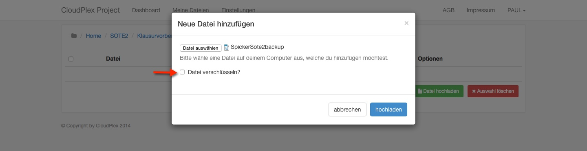
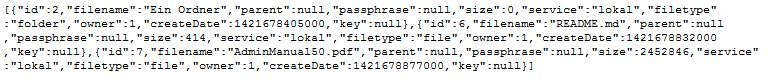
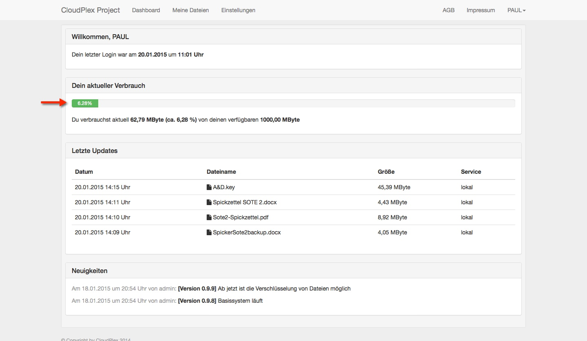

#Verwendete Technologien

Um eine stabile, sichere, funktionale und anschauliche Software zu entwickeln, haben wir hierbei auf folgende Technologien zurückgegriffen.

+ AJAX
	+ Laden der Inhalte für die Modalfenster
	

+ AJAX + JSON
	+ Laden der Tabellen für News und Dateien bzw. das Dashboard (Bild: Beispiel-JSON-Daten für die Dateiliste)
	

+ Websockets für die automatische Aktualisierung des Dashboards (Statusbalken, Updateliste, News)

+ Cookies zum Speichern der Session bzw. für die Funktion "angemeldet bleiben" beim Login
+ MySQL als Datenbankbackend
+ JDBC zur Benutzerverwaltung bzw. Rollenverwaltung
+ Ebean als ORM (Object Relationship Model) für die News, Dateien und Schlüssel (für DES-Verschlüsselung)
+ "javax.crypto" Library für die DES-Verschlüsselung von Dateien 
+ Für das Layout
	+ HTML5 für die Strukturdefinition
	+ Javascript bzw. jQuery für dynamisch nachladbare Inhalte, Websockets und Benutzerfreundlichkeit
	+ LESS bzw. CSS für die definition der Styles
	+ Twitter Bootstrap für ein responsive Design (Kompatibilität für mehrere Endgeräte)
+ "java.io" für den Zugriff auf das lokale Dateisystem

